# Cressco - Data Model / ERD

> **Document:** ERD.md
> **Product:** Cressco
> **Scope:** Core Bimbel MVP + platform entities required by the architecture
> **Primary Roles:** Owner, Admin, Tutor/Tentor
> **Platform Role:** Super Admin - Phase 2
> **Database Target:** MySQL
> **Application:** Laravel

---

# 1. Purpose

Dokumen ini mendefinisikan conceptual data model Cressco sebagai dasar untuk:

- database schema,
- Laravel migrations,
- Eloquent models,
- relationships,
- authorization,
- tenant isolation,
- reporting,
- dan implementasi feature.

ERD ini diturunkan dari:

```text
PRD.md
↓
USER-FLOWS.md
↓
ERD.md
↓
DATABASE-SCHEMA.sql
↓
Laravel Migrations
```

ERD menjelaskan **data dan relasinya**, bukan detail implementasi UI.

---

# 2. Data Architecture Principles

## 2.1 One Application, One Database

Cressco menggunakan:

```text
One Laravel Application
One MySQL Database
Many Tenants
```

Tenant isolation dilakukan secara logical melalui `tenant_id`.

---

## 2.2 Tenant as Primary Data Boundary

Konsep:

```text
Tenant
│
├── Branch
├── Users
├── Students
├── Classes
├── Schedules
├── Teaching Sessions
├── Payments
├── Honor
└── Reports
```

Operational data harus dapat ditelusuri kembali ke Tenant.

Untuk entity yang secara langsung merupakan tenant-scoped operational data, gunakan:

```text
tenant_id
```

sebagai foreign key ke:

```text
tenants.id
```

---

## 2.3 Branch as Operational Scope

Branch bukan role.

```text
Tenant
├── Branch A
├── Branch B
└── Branch C
```

Owner:

```text
All Branches
```

Admin:

```text
Assigned Branches
```

Tutor:

```text
Derived through Class Assignment
```

---

## 2.4 Role vs Scope

Role menentukan authority.

Branch access menentukan operational scope.

Jangan membuat role seperti:

```text
owner_surabaya
admin_surabaya
admin_gresik
```

Model yang benar:

```text
User
├── role = owner
└── branch access = all

User
├── role = admin
└── branch access = Surabaya + Gresik
```

---

# 3. Entity Catalog

Entity utama Cressco:

| Entity | Purpose | Scope |
|---|---|---|
| tenants | Organisasi/bimbel | Platform |
| branches | Cabang tenant | Tenant |
| users | Account/authentication | Tenant / Platform |
| branch_user | Branch access | Tenant + Branch |
| students | Data siswa | Tenant + Branch |
| enrollments | Student ↔ Class | Tenant + Branch |
| classes | Kelompok belajar | Tenant + Branch |
| tutor_assignments | Tutor ↔ Class | Tenant + Branch |
| schedules | Recurring schedule | Tenant + Branch |
| teaching_sessions | Concrete teaching event | Tenant + Branch |
| student_attendances | Attendance siswa | Tenant + Branch |
| tutor_attendances | Attendance Tutor | Tenant + Branch |
| assessments | Assessment kelas | Tenant + Branch |
| assessment_results | Hasil assessment siswa | Tenant + Branch |
| payments | Pembayaran siswa | Tenant + Branch |
| honor_schemes | Kebijakan honor | Tenant |
| honor_assignments | Scheme assignment | Tenant |
| honor_calculations | Hasil perhitungan honor | Tenant + Branch |
| tutor_replacements | Histori replacement | Tenant + Branch |
| tenant_settings | Konfigurasi tenant | Tenant |
| audit_logs | Audit trail | Tenant / Platform |

Catatan:

- Nama tabel di atas adalah conceptual recommendation.
- Laravel migrations dapat menggunakan naming convention final yang disepakati saat implementation.
- Super Admin tidak membutuhkan tabel operational khusus; Super Admin adalah role platform pada `users`.

---

# 4. Tenant

## Entity

```text
tenants
```

## Purpose

Mewakili satu organisasi/bimbel dalam Cressco.

## Core Attributes

| Field | Type Concept | Notes |
|---|---|---|
| id | UUID | Primary key |
| name | string | Nama bimbel |
| slug | string | Unique tenant identifier |
| status | enum/string | Active / Suspended / Inactive |
| logo | string nullable | Logo path/url |
| description | text nullable | Deskripsi |
| address | text nullable | Alamat |
| phone | string nullable | Kontak |
| email | string nullable | Kontak |
| created_at | datetime | |
| updated_at | datetime | |

## Constraints

```text
slug UNIQUE
```

Slug digunakan untuk target hostname:

```text
{tenant_slug}.cressco.app
```

Contoh:

```text
bimbelceria.cressco.app
```

---

# 5. Branch

## Entity

```text
branches
```

## Relationship

```text
Tenant 1 ──── N Branch
```

## Core Attributes

| Field | Type Concept | Notes |
|---|---|---|
| id | UUID | PK |
| tenant_id | UUID | FK → tenants.id |
| name | string | Nama cabang |
| code | string nullable | Kode cabang |
| address | text nullable | |
| phone | string nullable | |
| status | enum/string | Active / Inactive |
| created_at | datetime | |
| updated_at | datetime | |

## Constraints

```text
tenant_id + name UNIQUE
```

Branch harus selalu memiliki tenant.

---

# 6. User

## Entity

```text
users
```

User merupakan account untuk:

- Owner,
- Admin,
- Tutor,
- Super Admin.

## Relationship

```text
Tenant 1 ──── N Users
```

Untuk platform Super Admin, user dapat memiliki role platform.

## Core Attributes

| Field | Type Concept | Notes |
|---|---|---|
| id | UUID / Laravel user key | PK |
| tenant_id | UUID nullable | Tenant owner untuk operational user |
| name | string | Nama |
| email | string | Login identity |
| password | string | Authentication |
| role | enum/string | owner/admin/tutor/super_admin |
| status | enum/string | Active / Inactive / Invited |
| email_verified_at | datetime nullable | |
| created_at | datetime | |
| updated_at | datetime | |

## Important Rule

Role tidak ditentukan berdasarkan email.

Contoh:

```text
owner@bimbelceria.com
```

bukan otomatis Owner karena alamat email.

Role berasal dari data authorization.

---

# 7. Branch User Access

## Entity

```text
branch_user
```

Digunakan untuk many-to-many access antara User dan Branch.

## Relationship

```text
User N ──── N Branch
```

melalui:

```text
branch_user
```

## Core Attributes

| Field | Type Concept |
|---|---|
| id | UUID |
| tenant_id | UUID |
| branch_id | UUID |
| user_id | UUID |
| created_at | datetime |
| updated_at | datetime |

## Example

```text
Admin A
↓
branch_user
├── Surabaya
└── Gresik
```

Owner tidak perlu memiliki row untuk setiap branch apabila application authorization mendefinisikan Owner sebagai full-tenant access.

Namun implementasi final harus memilih satu konsisten strategy:

1. Owner full access secara policy, atau
2. Owner memiliki explicit access rows.

Rekomendasi MVP:

```text
Owner = full tenant access
Admin = branch_user access
Tutor = derived from assignment
```

---

# 8. Student

## Entity

```text
students
```

## Relationship

```text
Tenant 1 ──── N Students
Branch 1 ──── N Students
```

## Core Attributes

| Field | Type Concept | Notes |
|---|---|---|
| id | UUID | PK |
| tenant_id | UUID | FK |
| branch_id | UUID | FK |
| name | string | Nama |
| date_of_birth | date nullable | |
| gender | string nullable | |
| phone | string nullable | WhatsApp siswa |
| address | text nullable | |
| parent_name | string nullable | |
| parent_phone | string nullable | |
| notes | text nullable | |
| joined_at | date nullable | |
| status | enum/string | Active / Inactive |
| created_at | datetime | |
| updated_at | datetime | |

Student berada pada satu branch operasional dalam model MVP.

Jika kebutuhan multi-branch student muncul kemudian, branch membership dapat dievolusikan tanpa mengubah konsep Tenant.

---

# 9. Class

## Entity

```text
classes
```

## Relationship

```text
Tenant 1 ──── N Classes
Branch 1 ──── N Classes
```

## Core Attributes

| Field | Type Concept |
|---|---|
| id | UUID |
| tenant_id | UUID |
| branch_id | UUID |
| name | string |
| subject | string nullable |
| level | string nullable |
| capacity | integer nullable |
| status | enum/string |
| created_at | datetime |
| updated_at | datetime |

---

# 10. Enrollment

## Entity

```text
enrollments
```

Enrollment menghubungkan Student dengan Class.

## Relationship

```text
Student 1 ──── N Enrollment
Class   1 ──── N Enrollment
```

Secara konseptual:

```text
Student N ──── N Class
        via Enrollment
```

## Core Attributes

| Field | Type Concept |
|---|---|
| id | UUID |
| tenant_id | UUID |
| branch_id | UUID |
| student_id | UUID |
| class_id | UUID |
| started_at | date |
| ended_at | date nullable |
| status | enum/string |
| created_at | datetime |
| updated_at | datetime |

## Status

```text
active
completed
withdrawn
```

## Integrity

Student dan Class harus berada pada tenant yang sama.

Branch enrollment harus konsisten dengan branch class pada MVP.

---

# 11. Tutor Assignment

## Entity

```text
tutor_assignments
```

Menghubungkan Tutor dengan Class.

## Relationship

```text
Tutor N ──── N Class
        via Tutor Assignment
```

## Core Attributes

| Field | Type Concept |
|---|---|
| id | UUID |
| tenant_id | UUID |
| branch_id | UUID |
| tutor_id | FK → users.id |
| class_id | FK → classes.id |
| started_at | date nullable |
| ended_at | date nullable |
| status | enum/string |
| created_at | datetime |
| updated_at | datetime |

## Rule

`users.role` harus `tutor`.

Tutor assignment juga menjadi sumber branch scope Tutor:

```text
Tutor
↓
Tutor Assignment
↓
Class
↓
Branch
```

---

# 12. Recurring Schedule

## Entity

```text
schedules
```

Schedule adalah aturan jadwal berulang.

## Relationship

```text
Class 1 ──── N Schedule
Tutor Assignment 1 ──── N Schedule
```

## Core Attributes

| Field | Type Concept |
|---|---|
| id | UUID |
| tenant_id | UUID |
| branch_id | UUID |
| class_id | UUID |
| scheduled_tutor_id | UUID |
| day_of_week | integer/string |
| start_time | time |
| end_time | time |
| room | string nullable |
| starts_on | date |
| ends_on | date nullable |
| status | enum/string |
| created_at | datetime |
| updated_at | datetime |

## Important Concept

Schedule bukan sesi aktual.

```text
Schedule
= rule

Teaching Session
= event
```

---

# 13. Teaching Session

## Entity

```text
teaching_sessions
```

Teaching Session adalah concrete teaching event.

## Relationship

```text
Schedule 1 ──── N Teaching Sessions
Class 1 ──── N Teaching Sessions
```

## Core Attributes

| Field | Type Concept |
|---|---|
| id | UUID |
| tenant_id | UUID |
| branch_id | UUID |
| schedule_id | UUID nullable |
| class_id | UUID |
| scheduled_tutor_id | UUID |
| actual_tutor_id | UUID nullable |
| session_date | date |
| start_time | time |
| end_time | time |
| room | string nullable |
| status | enum/string |
| material | text nullable |
| notes | text nullable |
| created_at | datetime |
| updated_at | datetime |

## Status

```text
scheduled
completed
cancelled
```

## Critical Relationship

```text
scheduled_tutor_id
        +
actual_tutor_id
```

Normal:

```text
scheduled_tutor_id = Budi
actual_tutor_id = Budi
```

Replacement:

```text
scheduled_tutor_id = Budi
actual_tutor_id = Sinta
```

Future recurring schedule tetap menggunakan Tutor terjadwal normal.

---

# 14. Schedule Exception

MVP tidak membutuhkan entity schedule exception terpisah apabila perubahan satu kali disimpan langsung pada Teaching Session.

Contoh:

```text
Recurring Schedule:
Monday 19:00

Teaching Session:
12 Oct → Tuesday 19:00
```

Dengan demikian Teaching Session menjadi concrete override.

Jika kebutuhan exception kompleks muncul kemudian, entity `schedule_exceptions` dapat ditambahkan sebagai P1/P2.

---

# 15. Student Attendance

## Entity

```text
student_attendances
```

## Relationship

```text
Teaching Session 1 ──── N Student Attendance
Student 1 ──── N Student Attendance
```

## Core Attributes

| Field | Type Concept |
|---|---|
| id | UUID |
| tenant_id | UUID |
| branch_id | UUID |
| teaching_session_id | UUID |
| student_id | UUID |
| status | enum/string |
| note | text nullable |
| recorded_at | datetime |
| recorded_by | UUID |
| updated_at | datetime |

## Status

```text
hadir
izin
sakit
alpa
```

## Constraint

Satu student hanya boleh memiliki satu attendance record untuk satu Teaching Session.

Conceptual unique key:

```text
teaching_session_id + student_id
```

---

# 16. Tutor Attendance

## Entity

```text
tutor_attendances
```

Tutor attendance merupakan hasil dari aktivitas teaching session.

## Relationship

```text
Teaching Session 1 ──── 1 Tutor Attendance
Tutor 1 ──── N Tutor Attendance
```

## Core Attributes

| Field | Type Concept |
|---|---|
| id | UUID |
| tenant_id | UUID |
| branch_id | UUID |
| teaching_session_id | UUID |
| tutor_id | UUID |
| status | enum/string |
| recorded_at | datetime |
| source | string |
| created_at | datetime |
| updated_at | datetime |

## MVP Flow

```text
Tutor submits student attendance
↓
Successful save
↓
Create / update Tutor Attendance
```

`source` dapat digunakan untuk mencatat:

```text
student_attendance_submission
```

MVP tidak menggunakan GPS/selfie/check-in/out.

---

# 17. Assessment

## Entity

```text
assessments
```

Assessment dimiliki oleh Class.

## Relationship

```text
Class 1 ──── N Assessments
```

## Core Attributes

| Field | Type Concept |
|---|---|
| id | UUID |
| tenant_id | UUID |
| branch_id | UUID |
| class_id | UUID |
| name | string |
| type | enum/string |
| material | string/text nullable |
| assessment_date | date |
| max_score | decimal |
| notes | text nullable |
| created_by | UUID |
| created_at | datetime |
| updated_at | datetime |

## Types

```text
tugas
quiz
ujian
```

---

# 18. Assessment Result

## Entity

```text
assessment_results
```

## Relationship

```text
Assessment 1 ──── N Assessment Results
Student 1 ──── N Assessment Results
```

## Core Attributes

| Field | Type Concept |
|---|---|
| id | UUID |
| tenant_id | UUID |
| branch_id | UUID |
| assessment_id | UUID |
| student_id | UUID |
| score | decimal |
| notes | text nullable |
| created_at | datetime |
| updated_at | datetime |

## Constraint

Satu Student hanya memiliki satu result untuk satu Assessment.

```text
assessment_id + student_id UNIQUE
```

---

# 19. Payment

## Entity

```text
payments
```

Payment merepresentasikan pencatatan kewajiban/pembayaran siswa.

## Relationship

```text
Student 1 ──── N Payments
Enrollment 1 ──── N Payments
```

Untuk kebutuhan reminder multi-class, payment harus dapat ditelusuri ke enrollment.

## Core Attributes

| Field | Type Concept |
|---|---|
| id | UUID |
| tenant_id | UUID |
| branch_id | UUID |
| student_id | UUID |
| enrollment_id | UUID nullable |
| period | string/date concept |
| amount | decimal |
| due_date | date |
| paid_at | datetime nullable |
| status | enum/string |
| notes | text nullable |
| recorded_by | UUID |
| created_at | datetime |
| updated_at | datetime |

## Status

```text
belum_bayar
menunggu_verifikasi
lunas
terlambat
```

Payment gateway tidak menjadi dependency MVP.

---

# 20. Tenant Payment Configuration

Payment due date merupakan konfigurasi tenant.

Secara konseptual:

```text
Tenant
↓
Payment Configuration
↓
Due Day
```

MVP dapat menyimpan configuration melalui:

```text
tenant_settings
```

daripada membuat entity payment configuration terpisah.

---

# 21. Honor Scheme

## Entity

```text
honor_schemes
```

Mewakili policy/metode honor.

## Relationship

```text
Tenant 1 ──── N Honor Schemes
```

## Core Attributes

| Field | Type Concept |
|---|---|
| id | UUID |
| tenant_id | UUID |
| name | string |
| method | enum/string |
| rate | decimal nullable |
| percentage | decimal nullable |
| fixed_amount | decimal nullable |
| effective_from | date |
| effective_until | date nullable |
| status | enum/string |
| created_by | UUID |
| created_at | datetime |
| updated_at | datetime |

## Methods

```text
per_session
per_student
revenue_share
fixed_monthly
```

---

# 22. Honor Assignment

## Entity

```text
honor_assignments
```

Menghubungkan Honor Scheme dengan Tutor.

## Purpose

Mendukung:

```text
Tenant Default Scheme
+
Tutor Override
```

## Core Attributes

| Field | Type Concept |
|---|---|
| id | UUID |
| tenant_id | UUID |
| tutor_id | UUID nullable |
| honor_scheme_id | UUID |
| assignment_type | enum/string |
| effective_from | date |
| effective_until | date nullable |
| created_at | datetime |
| updated_at | datetime |

## Assignment Type

```text
default
tutor_override
```

Default:

```text
tutor_id = null
assignment_type = default
```

Override:

```text
tutor_id = Sinta
assignment_type = tutor_override
```

---

# 23. Honor Calculation

## Entity

```text
honor_calculations
```

Mewakili hasil perhitungan honor untuk Tutor pada periode tertentu.

## Relationship

```text
Tutor 1 ──── N Honor Calculations
Honor Scheme 1 ──── N Honor Calculations
```

## Core Attributes

| Field | Type Concept |
|---|---|
| id | UUID |
| tenant_id | UUID |
| branch_id | UUID nullable |
| tutor_id | UUID |
| honor_scheme_id | UUID |
| period_start | date |
| period_end | date |
| method | string |
| base_amount | decimal |
| adjustment_amount | decimal |
| final_amount | decimal |
| status | enum/string |
| finalized_at | datetime nullable |
| paid_at | datetime nullable |
| calculated_by | UUID |
| finalized_by | UUID nullable |
| created_at | datetime |
| updated_at | datetime |

## Status

```text
draft
final
paid
```

---

# 24. Honor Calculation Source

Honor calculation harus dapat ditelusuri ke data sumber.

Minimal source dependency:

### Per Session

```text
Honor Calculation
↓
Teaching Sessions
↓
Actual Tutor
```

### Per Student

```text
Honor Calculation
↓
Applicable Students / Enrollments
↓
Tutor Assignment
```

### Revenue Share

```text
Honor Calculation
↓
Recorded/Paid Payments
```

### Fixed Monthly

```text
Honor Calculation
↓
Honor Scheme
```

Implementasi dapat menggunakan detail/source table khusus apabila auditability membutuhkan line-item calculation.

Recommended future/P1 entity:

```text
honor_calculation_items
```

Untuk MVP, keputusan apakah source line-item wajib disimpan perlu dikunci di `BUSINESS-RULES.md` sebelum migration final.

---

# 25. Tutor Replacement

## Entity

```text
tutor_replacements
```

Menyimpan histori perubahan Actual Tutor.

## Relationship

```text
Teaching Session 1 ──── N Tutor Replacement History
```

Dalam normal operational flow, satu session biasanya memiliki maksimal satu active replacement, tetapi histori dapat menyimpan lebih dari satu perubahan jika replacement diubah kembali.

## Core Attributes

| Field | Type Concept |
|---|---|
| id | UUID |
| tenant_id | UUID |
| branch_id | UUID |
| teaching_session_id | UUID |
| scheduled_tutor_id | UUID |
| previous_actual_tutor_id | UUID nullable |
| replacement_tutor_id | UUID |
| reason | string/text |
| changed_by | UUID |
| changed_at | datetime |
| created_at | datetime |

## Important Rule

Replacement tidak mengubah recurring Schedule.

---

# 26. Tenant Settings

## Entity

```text
tenant_settings
```

Digunakan untuk konfigurasi tenant yang tidak membutuhkan entity khusus.

## Core Attributes

| Field | Type Concept |
|---|---|
| id | UUID |
| tenant_id | UUID |
| key | string |
| value | JSON/text |
| created_at | datetime |
| updated_at | datetime |

Potential keys:

```text
payment_due_day
default_honor_scheme_id
business_contact
operational_settings
```

Implementasi final harus menentukan apakah konfigurasi tertentu lebih tepat menjadi typed columns daripada generic key/value.

Untuk konfigurasi yang critical terhadap financial/business logic, typed columns atau dedicated tables lebih aman jika query/reporting intensif.

---

# 27. Audit Logs

## Entity

```text
audit_logs
```

Digunakan untuk perubahan penting.

## Core Attributes

| Field | Type Concept |
|---|---|
| id | UUID |
| tenant_id | UUID nullable |
| actor_user_id | UUID nullable |
| action | string |
| entity_type | string |
| entity_id | UUID/string |
| old_values | JSON nullable |
| new_values | JSON nullable |
| metadata | JSON nullable |
| created_at | datetime |

## Important Actions

Minimal dapat mencatat:

- branch changes,
- user/role changes,
- branch access changes,
- payment changes,
- honor configuration changes,
- honor finalization,
- tutor replacement,
- tenant settings changes,
- support mode activity pada Phase 2.

---

# 28. Super Admin Data Boundary

Super Admin adalah platform role.

```text
users.role = super_admin
```

Super Admin tidak menjadi bagian dari operational tenant role hierarchy.

Concept:

```text
Platform
│
└── Super Admin

Tenant
├── Owner
├── Admin
└── Tutor
```

Super Admin dapat mengakses tenant melalui platform authorization dan Support Mode pada Phase 2.

Support Mode tidak mengubah:

```text
users.role
```

dan tidak mengubah tenant ownership.

---

# 29. Main ERD

```mermaid
erDiagram

    TENANTS ||--o{ BRANCHES : has
    TENANTS ||--o{ USERS : has
    TENANTS ||--o{ STUDENTS : has
    TENANTS ||--o{ CLASSES : has
    TENANTS ||--o{ ENROLLMENTS : has
    TENANTS ||--o{ TUTOR_ASSIGNMENTS : has
    TENANTS ||--o{ SCHEDULES : has
    TENANTS ||--o{ TEACHING_SESSIONS : has
    TENANTS ||--o{ PAYMENTS : has
    TENANTS ||--o{ HONOR_SCHEMES : has
    TENANTS ||--o{ HONOR_ASSIGNMENTS : has
    TENANTS ||--o{ HONOR_CALCULATIONS : has
    TENANTS ||--o{ AUDIT_LOGS : has

    BRANCHES ||--o{ STUDENTS : contains
    BRANCHES ||--o{ CLASSES : contains
    BRANCHES ||--o{ ENROLLMENTS : scopes
    BRANCHES ||--o{ TUTOR_ASSIGNMENTS : scopes
    BRANCHES ||--o{ SCHEDULES : scopes
    BRANCHES ||--o{ TEACHING_SESSIONS : scopes
    BRANCHES ||--o{ PAYMENTS : scopes
    BRANCHES ||--o{ HONOR_CALCULATIONS : scopes

    USERS ||--o{ BRANCH_USER : accesses
    BRANCHES ||--o{ BRANCH_USER : grants

    STUDENTS ||--o{ ENROLLMENTS : joins
    CLASSES ||--o{ ENROLLMENTS : contains

    USERS ||--o{ TUTOR_ASSIGNMENTS : teaches
    CLASSES ||--o{ TUTOR_ASSIGNMENTS : assigned

    CLASSES ||--o{ SCHEDULES : has
    USERS ||--o{ SCHEDULES : scheduled

    SCHEDULES ||--o{ TEACHING_SESSIONS : generates
    CLASSES ||--o{ TEACHING_SESSIONS : has
    USERS ||--o{ TEACHING_SESSIONS : scheduled_tutor
    USERS ||--o{ TEACHING_SESSIONS : actual_tutor

    TEACHING_SESSIONS ||--o{ STUDENT_ATTENDANCES : records
    STUDENTS ||--o{ STUDENT_ATTENDANCES : attends
    TEACHING_SESSIONS ||--o| TUTOR_ATTENDANCES : records
    USERS ||--o{ TUTOR_ATTENDANCES : attends

    CLASSES ||--o{ ASSESSMENTS : has
    ASSESSMENTS ||--o{ ASSESSMENT_RESULTS : produces
    STUDENTS ||--o{ ASSESSMENT_RESULTS : receives

    STUDENTS ||--o{ PAYMENTS : makes
    ENROLLMENTS ||--o{ PAYMENTS : generates

    HONOR_SCHEMES ||--o{ HONOR_ASSIGNMENTS : assigned
    USERS ||--o{ HONOR_ASSIGNMENTS : overrides
    USERS ||--o{ HONOR_CALCULATIONS : receives
    HONOR_SCHEMES ||--o{ HONOR_CALCULATIONS : used_for

    TEACHING_SESSIONS ||--o{ TUTOR_REPLACEMENTS : has
    USERS ||--o{ TUTOR_REPLACEMENTS : previous_tutor
    USERS ||--o{ TUTOR_REPLACEMENTS : replacement_tutor
    USERS ||--o{ TUTOR_REPLACEMENTS : changed_by

    USERS ||--o{ AUDIT_LOGS : acts
```



---

# 30. Relationship Summary

| Relationship | Cardinality |
|---|---|
| Tenant → Branch | 1:N |
| Tenant → User | 1:N |
| Tenant → Student | 1:N |
| Tenant → Class | 1:N |
| User ↔ Branch | N:M via branch_user |
| Student ↔ Class | N:M via Enrollment |
| Tutor ↔ Class | N:M via Tutor Assignment |
| Class → Schedule | 1:N |
| Schedule → Teaching Session | 1:N |
| Class → Teaching Session | 1:N |
| Teaching Session → Student Attendance | 1:N |
| Student → Student Attendance | 1:N |
| Teaching Session → Tutor Attendance | 1:1 |
| Class → Assessment | 1:N |
| Assessment → Result | 1:N |
| Student → Result | 1:N |
| Student → Payment | 1:N |
| Enrollment → Payment | 1:N |
| Tenant → Honor Scheme | 1:N |
| Honor Scheme → Honor Assignment | 1:N |
| Tutor → Honor Calculation | 1:N |
| Honor Scheme → Honor Calculation | 1:N |
| Teaching Session → Tutor Replacement | 1:N |

---

# 31. Data Flow

## 31.1 Student Flow

```text
Student
↓
Enrollment
↓
Class
↓
Schedule
↓
Teaching Session
↓
Attendance
↓
Reports
```

## 31.2 Tutor Flow

```text
User (Tutor)
↓
Tutor Assignment
↓
Class
↓
Schedule
↓
Teaching Session
↓
Actual Tutor
↓
Tutor Attendance
↓
Honor Calculation
```

## 31.3 Payment Flow

```text
Student
↓
Enrollment
↓
Payment
↓
Payment Status
↓
Reminder
↓
Financial Reports
```

## 31.4 Honor Flow

```text
Honor Scheme
↓
Honor Assignment
↓
Source Data
├── Teaching Session
├── Enrollment / Student
└── Payment
↓
Honor Calculation
↓
Final
↓
Paid
```

---

# 32. Branch Scoping Matrix

| Entity | Branch Scope | Reason |
|---|---|---|
| Tenant | No | Parent scope |
| User | Tenant | User belongs to tenant |
| Branch | Tenant | Branch itself |
| Branch User | Yes | Access mapping |
| Student | Yes | Operational branch |
| Enrollment | Yes | Enrollment scope |
| Class | Yes | Class belongs to branch |
| Tutor Assignment | Yes | Assignment belongs to branch |
| Schedule | Yes | Schedule belongs to branch |
| Teaching Session | Yes | Session belongs to branch |
| Attendance | Yes | Derived from session |
| Assessment | Yes | Class scope |
| Assessment Result | Yes | Assessment scope |
| Payment | Yes | Student/payment operation |
| Honor Scheme | No | Tenant-level policy |
| Honor Assignment | No | Tenant-level policy assignment |
| Honor Calculation | Yes/Nullable | Can aggregate multiple branches |
| Tutor Replacement | Yes | Session scope |
| Tenant Settings | No | Tenant-level |
| Audit Log | Tenant/Platform | Depends on actor/action |

---

# 33. Tenant Isolation Requirements

Every operational query must resolve tenant context before retrieving data.

Conceptually:

```text
Request
↓
Authenticated User
↓
Tenant Context
↓
Authorization
↓
Branch Scope
↓
Resource Query
```

Do not rely only on:

```text
WHERE branch_id = ?
```

karena branch ID saja tidak cukup untuk menjamin tenant isolation.

Conceptual query boundary:

```text
tenant_id = currentTenant
AND branch_id IN allowedBranches
```

Owner:

```text
tenant_id = currentTenant
```

Admin:

```text
tenant_id = currentTenant
AND branch_id IN adminAllowedBranches
```

Tutor:

```text
tenant_id = currentTenant
AND resource is connected to tutor assignment
```

---

# 34. Referential Integrity

Entity relationships harus menjaga:

1. Student dan Class berada pada tenant yang sama.
2. Enrollment tidak boleh menghubungkan Student dan Class lintas tenant.
3. Tutor Assignment tidak boleh menghubungkan Tutor dan Class lintas tenant.
4. Schedule tidak boleh menggunakan Class dari tenant lain.
5. Teaching Session tidak boleh menggunakan Tutor dari tenant lain.
6. Attendance tidak boleh menggunakan Student dari tenant lain.
7. Payment tidak boleh menggunakan Student/Enrollment dari tenant lain.
8. Honor Assignment tidak boleh menggunakan Tutor dari tenant lain.
9. Honor Calculation tidak boleh menggunakan Tutor/Scheme dari tenant lain.
10. Replacement hanya berlaku pada Teaching Session yang sama tenant.

Database foreign key menjaga existence.

Application/service/policy layer menjaga tenant consistency apabila composite cross-entity constraints tidak dapat ditegakkan secara langsung oleh FK sederhana.

---

# 35. Unique Constraints Recommendations

Recommended conceptual constraints:

```text
tenants.slug
```

Unique globally.

```text
branches (tenant_id, name)
```

Unique within tenant.

```text
student_attendances (teaching_session_id, student_id)
```

Unique.

```text
assessment_results (assessment_id, student_id)
```

Unique.

```text
branch_user (branch_id, user_id)
```

Unique.

Tutor assignment dapat mencegah duplicate active assignment:

```text
(tutor_id, class_id)
```

dengan strategi status/effective dates sesuai implementation.

Enrollment dapat menggunakan:

```text
(student_id, class_id, active period)
```

dengan aturan lifecycle yang dikunci di Business Rules.

---

# 36. Indexing Recommendations

Minimal index pada:

### Tenant

```text
slug
status
```

### Branch

```text
tenant_id
tenant_id + status
```

### Users

```text
tenant_id
email
role
status
```

### Branch User

```text
tenant_id
branch_id
user_id
```

### Students

```text
tenant_id
branch_id
status
tenant_id + branch_id
```

### Classes

```text
tenant_id
branch_id
status
```

### Enrollments

```text
tenant_id
branch_id
student_id
class_id
status
```

### Tutor Assignments

```text
tenant_id
branch_id
tutor_id
class_id
status
```

### Schedules

```text
tenant_id
branch_id
class_id
scheduled_tutor_id
status
```

### Teaching Sessions

```text
tenant_id
branch_id
class_id
session_date
scheduled_tutor_id
actual_tutor_id
status
```

### Attendance

```text
tenant_id
branch_id
teaching_session_id
student_id
status
```

### Payments

```text
tenant_id
branch_id
student_id
enrollment_id
due_date
status
```

### Honor

```text
tenant_id
tutor_id
effective_from
status
```

---

# 37. Lifecycle / Status Model

## Tenant

```text
active
suspended
inactive
```

## Branch

```text
active
inactive
```

## User

```text
invited
active
inactive
```

## Student

```text
active
inactive
```

## Enrollment

```text
active
completed
withdrawn
```

## Class

```text
active
inactive
```

## Tutor Assignment

```text
active
inactive
```

## Schedule

```text
active
inactive
```

## Teaching Session

```text
scheduled
completed
cancelled
```

## Payment

```text
belum_bayar
menunggu_verifikasi
lunas
terlambat
```

## Honor Calculation

```text
draft
final
paid
```

---

# 38. Deletion Strategy

Operational records sebaiknya tidak menggunakan hard delete secara sembarangan.

Untuk entity yang memiliki histori:

```text
Student
Class
Tutor Assignment
Schedule
Teaching Session
Payment
Honor Calculation
Attendance
Assessment
```

gunakan lifecycle/status atau soft delete sesuai kebutuhan.

Contoh:

```text
Student
status = inactive
```

lebih aman daripada menghapus student yang sudah memiliki:

- enrollment,
- attendance,
- payment,
- assessment history.

Historical financial and attendance records harus tetap dapat ditelusuri.

---

# 39. Auditability

Audit trail diperlukan untuk action penting.

Minimal:

```text
Actor
Tenant
Action
Entity
Entity ID
Timestamp
Old Values
New Values
Metadata
```

Contoh:

```text
Admin Sinta
changed Teaching Session #123
Actual Tutor:
Budi → Sari
Reason:
Tutor berhalangan
Timestamp:
2026-10-12 17:30
```

---

# 40. Important Data Modeling Decisions

## 40.1 User vs Tutor

Tidak perlu membuat authentication account terpisah dari Tutor untuk MVP.

Tutor dapat direpresentasikan oleh:

```text
users.role = tutor
```

Sehingga:

```text
User
↓
Tutor Assignment
```

menggunakan user yang sama.

Jika kebutuhan profil Tutor berkembang, `tutor_profiles` dapat ditambahkan kemudian.

---

## 40.2 Owner vs Admin

Keduanya menggunakan:

```text
users
```

dengan role:

```text
owner
admin
```

Perbedaan authority berasal dari authorization.

---

## 40.3 Tutor vs Branch

Tutor tidak memiliki fixed branch sebagai primary authority.

Scope:

```text
Tutor
↓
Class Assignment
↓
Class
↓
Branch
```

---

## 40.4 Schedule vs Teaching Session

Jangan menggabungkan keduanya.

```text
Schedule
= recurring rule

Teaching Session
= actual event
```

Pemisahan ini penting untuk:

- replacement,
- cancellation,
- one-time rescheduling,
- attendance,
- honor,
- reporting.

---

## 40.5 Scheduled Tutor vs Actual Tutor

Keduanya wajib dipisahkan pada Teaching Session.

```text
scheduled_tutor_id
actual_tutor_id
```

Ini merupakan core requirement untuk replacement dan honor.

---

## 40.6 Honor Policy vs Honor Result

Jangan menyimpan hanya hasil akhir.

Pisahkan:

```text
Honor Scheme
↓
Honor Assignment
↓
Honor Calculation
```

Policy dapat berubah, tetapi histori calculation harus tetap konsisten.

---

# 41. Open Decisions for BUSINESS-RULES.md

Beberapa detail perlu dikunci sebelum database schema final.

## 41.1 Student Branch

Saat ini MVP mengasumsikan:

```text
Student → Branch
```

Jika siswa dapat berpindah branch atau mengikuti kelas di branch berbeda, perlu aturan lifecycle yang lebih eksplisit.

## 41.2 Enrollment Payment

Perlu dikunci apakah satu Payment selalu terkait:

```text
Enrollment
```

atau dapat menjadi:

```text
Student-level payment
```

Rekomendasi untuk MVP: payment terkait Enrollment jika tagihan berasal dari kelas tertentu.

## 41.3 Honor Per Student

Perlu dikunci basis tepat:

```text
active students
```

pada tanggal apa dan bagaimana partial month dihitung.

## 41.4 Revenue Share

Perlu dikunci:

- revenue berdasarkan payment date atau service period,
- apakah refund dikurangi,
- bagaimana partial payment diperlakukan,
- bagaimana satu payment untuk beberapa class dialokasikan.

## 41.5 Honor Branch Aggregation

Perlu dikunci apakah:

```text
One Tutor
+
Multiple Branches
+
One Honor Calculation
```

atau calculation dipisahkan per branch.

## 41.6 Teaching Session Generation

Perlu dikunci:

- kapan session dibuat,
- berapa jauh ke depan,
- bagaimana recurring schedule berubah,
- bagaimana sesi yang sudah dibuat diperlakukan.

## 41.7 Assessment Scope

Perlu dikunci apakah Assessment selalu melekat ke Class atau dapat melekat ke Teaching Session.

MVP saat ini mengarah ke:

```text
Assessment → Class
```

---

# 42. Recommended Implementation Mapping

Conceptual entity → Laravel implementation:

```text
Tenant
→ Tenant Model

Branch
→ Branch Model

User
→ User Model

Branch User
→ Pivot relationship

Student
→ Student Model

Enrollment
→ Enrollment Model

Class
→ Class Model

Tutor Assignment
→ TutorAssignment Model

Schedule
→ Schedule Model

Teaching Session
→ TeachingSession Model

Student Attendance
→ StudentAttendance Model

Tutor Attendance
→ TutorAttendance Model

Assessment
→ Assessment Model

Assessment Result
→ AssessmentResult Model

Payment
→ Payment Model

Honor Scheme
→ HonorScheme Model

Honor Assignment
→ HonorAssignment Model

Honor Calculation
→ HonorCalculation Model

Tutor Replacement
→ TutorReplacement Model

Tenant Settings
→ TenantSetting Model

Audit Log
→ AuditLog Model
```

Laravel migrations menjadi implementasi database sebenarnya.

`DATABASE-SCHEMA.sql` nantinya menjadi blueprint/reference SQL.

---

# 43. Final Conceptual Model

Core relationship:

```text
TENANT
│
├── BRANCH
│   │
│   ├── STUDENT
│   │   └── ENROLLMENT ─── CLASS
│   │                         │
│   │                         ├── TUTOR ASSIGNMENT ─── USER(TUTOR)
│   │                         │
│   │                         └── SCHEDULE
│   │                              │
│   │                              └── TEACHING SESSION
│   │                                   ├── STUDENT ATTENDANCE
│   │                                   ├── TUTOR ATTENDANCE
│   │                                   ├── MATERIAL
│   │                                   ├── NOTES
│   │                                   └── TUTOR REPLACEMENT
│   │
│   ├── PAYMENT
│   │
│   └── HONOR CALCULATION
│
├── USERS
│   ├── OWNER
│   ├── ADMIN
│   └── TUTOR
│
├── HONOR SCHEMES
│   └── HONOR ASSIGNMENTS
│
├── TENANT SETTINGS
│
└── AUDIT LOGS
```

Platform:

```text
CRESSCO PLATFORM
│
└── USERS
    └── SUPER ADMIN
```

Super Admin dapat mengakses tenant melalui platform authorization pada Phase 2 tanpa menjadi operational tenant user.

---

# 44. ERD Readiness Criteria

ERD dianggap siap menjadi dasar `DATABASE-SCHEMA.sql` apabila:

- Tenant boundary telah jelas.
- Branch scope telah jelas.
- User/role model telah jelas.
- Branch access telah jelas.
- Student ↔ Enrollment ↔ Class telah jelas.
- Tutor ↔ Class Assignment telah jelas.
- Schedule dan Teaching Session terpisah.
- Scheduled Tutor dan Actual Tutor terpisah.
- Attendance model telah jelas.
- Payment model telah jelas.
- Honor Scheme → Assignment → Calculation telah jelas.
- Replacement history telah jelas.
- Audit requirements telah jelas.
- Open business rules telah dikunci atau ditandai eksplisit.
- Composite tenant consistency telah direncanakan.
- Index dan unique constraints telah diidentifikasi.

Setelah poin tersebut dikunci, dokumen berikutnya adalah:

```text
ERD.md
↓
DATABASE-SCHEMA.sql
↓
Laravel Migrations
```
